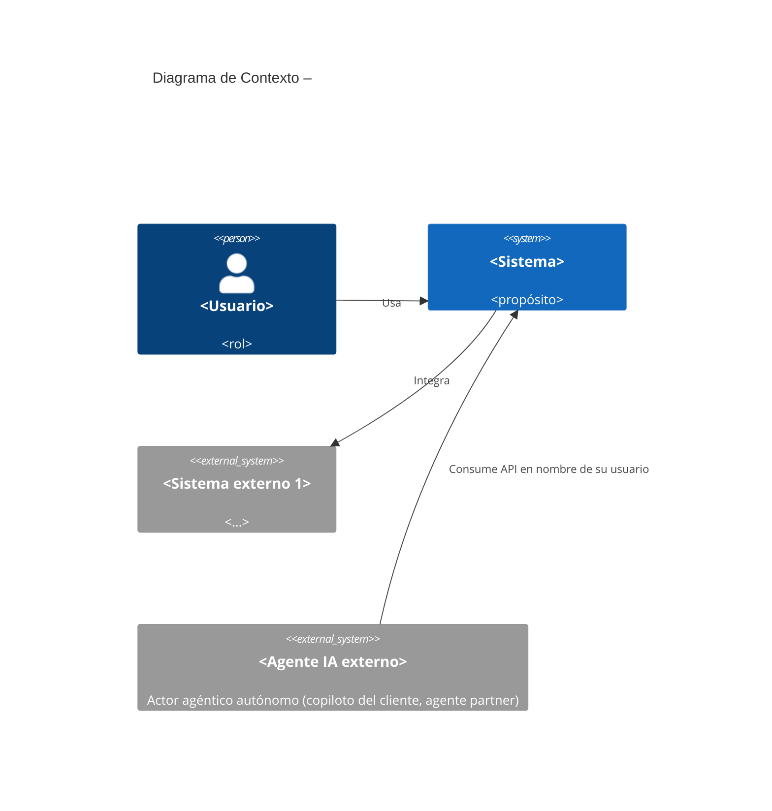
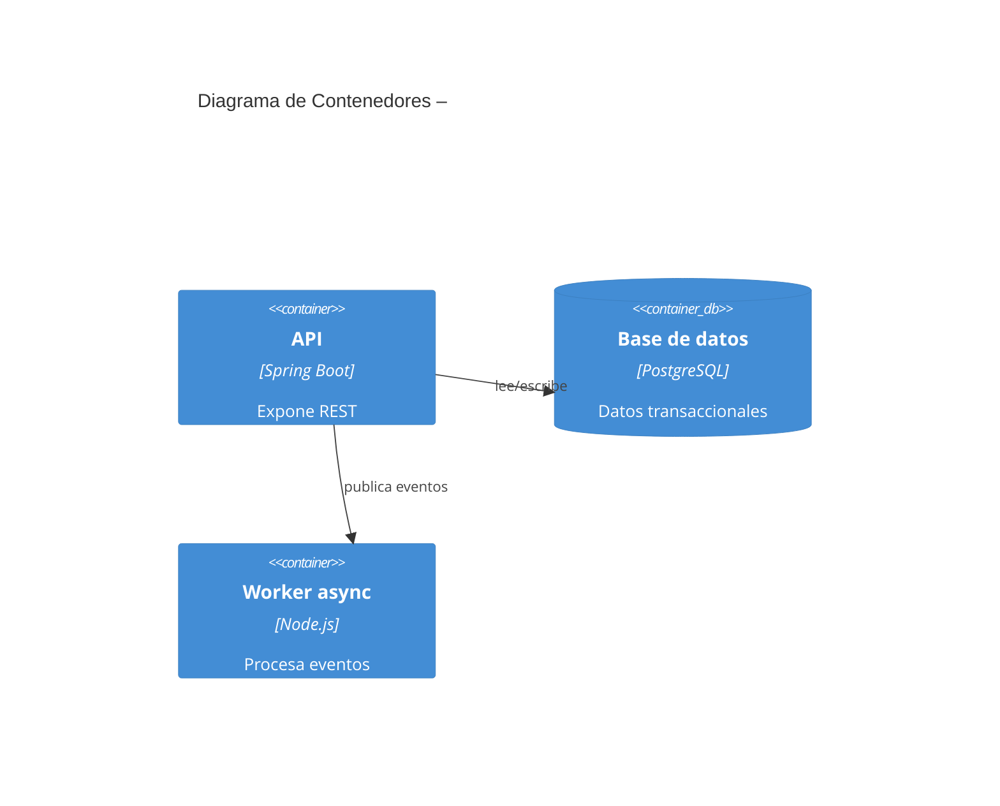
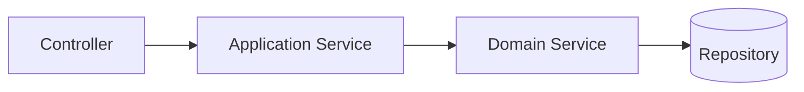
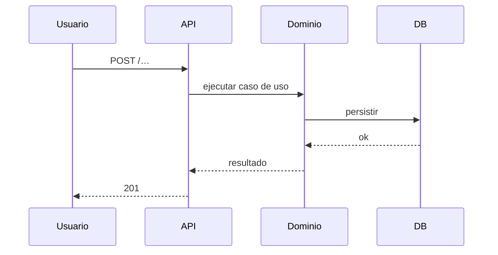
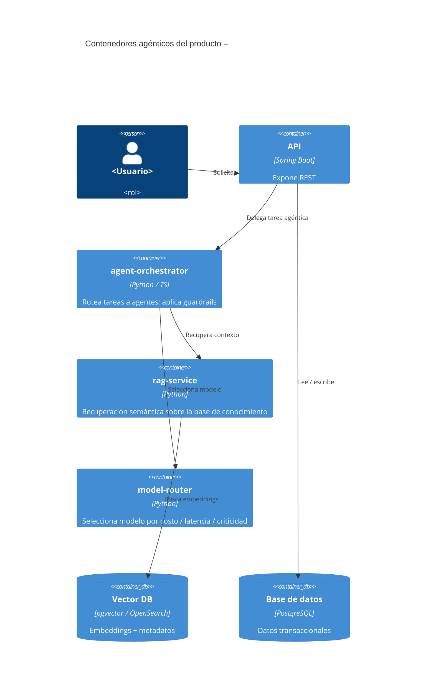
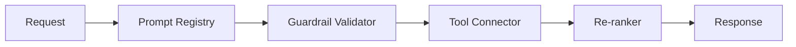
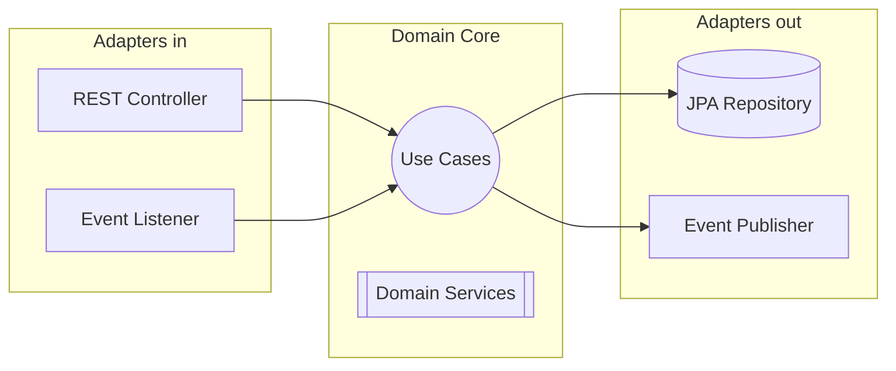
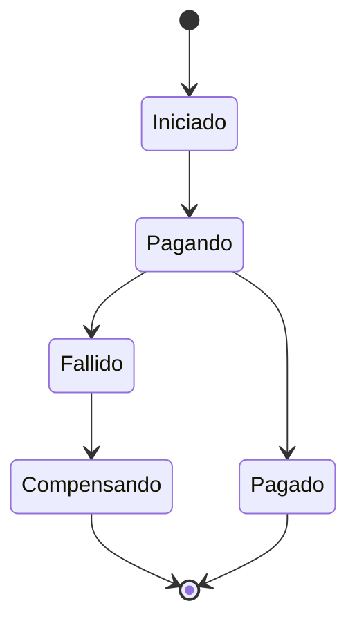
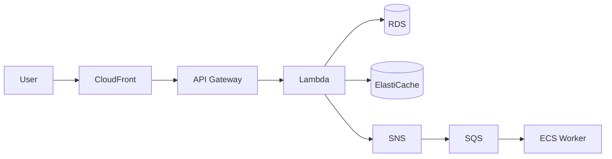
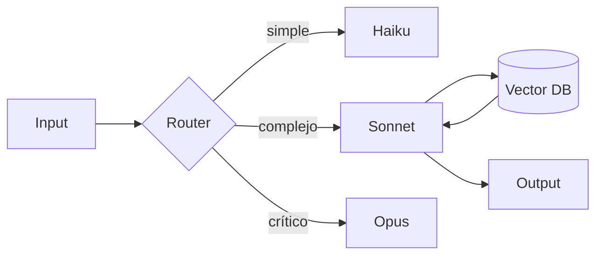

# Documento Técnico Inicial del Producto (DTI) – Plantilla

> **Propósito**: este documento es el **contrato técnico inicial** del producto. Debe ser legible tanto por ingenieros humanos como por agentes de IA. Acompaña obligatoriamente al archivo `AGENTS.md` en la raíz del repositorio.
>
> **Audiencia dual**
> - **Humanos**: arquitectos, desarrolladores, QA, *product managers*.
> - **Agentes IA**: Claude, Cursor Agent, Copilot, agentes custom. Leerán este DTI como contexto primario.
>
> **Regla de oro**: si una decisión arquitectónica significativa no está aquí (o referenciada desde aquí), no existe.
>
> **Plantillas relacionadas**:
> - `plantillas/AGENTS_TEMPLATE.md` – versión ejecutable para agentes.
> - `plantillas/ADR_TEMPLATE.md` – decisiones arquitectónicas individuales.
> - `plantillas/POC_TEMPLATE.md` – pruebas de concepto.
> - `plantillas/PROMPT_TEMPLATE.md` – prompts derivados de specs.
> - `plantillas/FSD_TEMPLATE.md`, `MRD_TEMPLATE.md`, `PRD_TEMPLATE.md`, `BRD_TEMPLATE.md` – cadena documental.

---

## 0. Metadatos `[máquina]`

| Campo | Valor |
|-------|-------|
| Producto | `<Nombre>` |
| Grupo | `<G1/G2/G3/G4>` |
| Versión | `v0.1` |
| Fecha | `<dd/mm/aaaa>` |
| Arquitecto responsable | `<…>` |
| Stakeholders | `<…>` |
| Estado | Borrador / En revisión / Aprobado |
| Repositorio | `<url>` |
| Enlace al BRD | `docs/brd/<archivo>.md` (si aplica) |
| Enlace al MRD | `docs/mrd/<archivo>.md` |
| Enlace al PRD | `docs/prd/<archivo>.md` |
| Enlace al FSD | `docs/fsd/<archivo>.md` |
| Enlace a `AGENTS.md` | `/AGENTS.md` |
| Enlace a `PROMPT_MAPPING.md` | `docs/PROMPT_MAPPING.md` |

> **Frontmatter YAML obligatorio** (ver bloque YAML al inicio de este archivo): las claves **`producto`**, **`version`**, **`stack`** (lista) y **`audiencia`** son **obligatorias** y deben coincidir con los valores de la tabla anterior. El resto del frontmatter (`grupo`, `fecha`, `status`, `repo`, `agents_md`, `artefactos_relacionados`, `adrs_vigentes`, `skills_aplicados`, `release_objetivo`) es **fuertemente recomendado**: lo consumen los agentes IA del módulo (`dti-author`, `c4-architect`, `poc-runner`) y el lint de CI. Ver glosario S06 §D.2.3 y §D.2.1 (audiencia dual). En este módulo `audiencia` es **siempre** `dual`.

### 0.1 Rol de agentes IA en el SDLC `[máquina]`

> Esta tabla declara **qué agentes operan en cada fase del ciclo de vida del producto**, qué *output* producen, quién los supervisa, qué *skill* propio los orquesta y qué se actualiza si el agente falla. Es la versión **proceso** del DTI; espejea con `AGENTS.md` (los agentes activos del grupo).

| Agente | Fase SDLC | Output | Supervisor humano | Skill propio que orquesta | Qué se actualiza si el agente falla |
|--------|-----------|--------|-------------------|---------------------------|-------------------------------------|
| `c4-architect` | Diseño | Diagramas C4 niveles 1–3 en Mermaid | Arquitecto del grupo | [`docs/skills/c4.md`](../docs/skills/c4.md) | ADR-0001 + DTI §3 |
| `dti-author` | Diseño / Docs | Secciones del DTI con frontmatter + tags | Arquitecto del grupo | [`docs/skills/dti-author.md`](../docs/skills/dti-author.md) | DTI + `AGENTS.md` (commit atómico) |
| `poc-runner` | Validación | Scaffold de POC + log pass/fail | Líder técnico del grupo | [`docs/skills/poc-runner.md`](../docs/skills/poc-runner.md) | ADR + DTI §12 + `AGENTS.md` |
| `kanban-skill` (de S05) | Implementación | Código siguiendo FSD-UC-NNN | Desarrollador | Skill propio del grupo | FSD + tests + AGENTS.md §Skills |
| `auditor` *(opcional)* | Revisión | Reporte de gaps BRD↔MRD↔PRD↔FSD↔DTI | Docente | Skill propio del grupo | Issues en repo |

> **Nota**: `[máquina]` significa que esta tabla es consumida por agentes que leen el DTI como contexto. Mantenerla sincronizada con `AGENTS.md` en cada commit que cambia agentes o skills activos del grupo.

## 1. Visión del Producto (1 página) `[humano]`

- **Problema**: `<…>`
- **Usuarios objetivo**: `<…>`
- **Propuesta de valor**: `<…>`
- **Métricas de éxito del producto** (1 North Star + 3 secundarias).
- **Restricciones de negocio** clave (presupuesto, plazos, cumplimiento).

## 2. Contexto del Sistema `[humano+máquina]`

### 2.1 Diagrama C4 – Nivel 1 (Contexto)

> Si el producto **consume** agentes IA externos (copiloto del cliente, agente partner) o **expone** agentes propios a terceros, modelarlos como `System_Ext` en este diagrama. Son **actores autónomos de pleno derecho del nivel 1**, distintos de los **contenedores agénticos internos** de §3.5.

### 2.2 Actores externos y dependencias

| Actor / Sistema | Tipo | Dirección | Criticidad |
|-----------------|------|-----------|------------|
| `<…>` | humano / sistema / agente IA externo | entrada / salida | alta / media / baja |
| `<Copiloto del cliente>` | agente IA externo | entrada | media |

> Valores admisibles en `Tipo`: **`humano`** (usuario final, operador), **`sistema`** (servicio o aplicación externa), **`agente IA externo`** (actor agéntico autónomo). Si el `Tipo` es `agente IA externo`, debe aparecer también en el bloque Mermaid de §2.1 como `System_Ext`.

## 3. Arquitectura de Alto Nivel `[humano+máquina]`

### 3.1 Estilo arquitectónico adoptado

Elegir y **justificar** uno o combinación:

- [ ] Monolito modular
- [ ] Hexagonal / Clean
- [ ] Microservicios
- [ ] Serverless
- [ ] Event‑driven
- [ ] Híbrida (especificar)

> **Justificación** (mínimo 1 párrafo): por qué este estilo dado el dominio, volumen, equipo y restricciones. Crear un ADR independiente con esta decisión (`docs/adr/0001-estilo-arquitectonico.md`).

### 3.2 Diagrama C4 – Nivel 2 (Contenedores)

### 3.3 Diagrama C4 – Nivel 3 (Componentes) del módulo crítico

### 3.4 Data Flow Diagram (Dynamic diagram del C4) del caso de uso más crítico

> Según [c4model.com](https://c4model.com/diagrams/dynamic), un **Dynamic diagram** muestra cómo cooperan los elementos C4 estáticos para satisfacer un caso de uso. Esta subsección cumple ese rol; §7.2 (sagas) cubre otra variante de Dynamic diagram para flujos de larga duración.

### 3.5 Contenedores agénticos del producto `[humano+máquina]`

> **Obligatorio si el producto tiene capa IA en runtime**. Si no, marcar `N/A` con 1 línea de justificación (ej. *"AcademiaSys v1.0 no expone agentes en runtime; la IA solo participa en la cadena de desarrollo, ver §0.1"*).
>
> Esta subsección garantiza que los **orquestadores, agentes y servicios IA aparezcan como contenedores de primera clase** en el C4 del producto, no como una capa anexa. El detalle de modelos, RAG y *guardrails* sigue viviendo en §9; aquí solo se asegura su presencia en la arquitectura.

#### Diagrama C4 Container con agentes first-class

#### Tabla de agentes y servicios IA del producto

| Agente / Servicio IA | Responsabilidad | Tools (allowed) | Modelo |
|----------------------|-----------------|------------------|--------|
| `agent-orchestrator` | Rutea tareas; aplica *guardrails* | `listAgents`, `dispatch` | Sonnet |
| `rag-service` | Recuperación semántica | `embed`, `search` | `text-embedding-3-small` |
| `model-router` | Selecciona modelo por costo / latencia / criticidad | `pickModel` | regla heurística + Haiku |

> **Cruce con §9**: el detalle de *guardrails*, *re-rankers*, política de *freshness*, *tree of models* y observabilidad de agentes sigue en §9. Esta tabla solo cumple el contrato C4: los agentes existen como contenedores con responsabilidad clara, tools acotadas y modelo declarado.

#### 3.5.1 Componentes internos de un contenedor agéntico (C4 Nivel 3) `[humano+máquina]`

> Aplica **si §3.3 baja a nivel 3 en un contenedor agéntico** (`agent-orchestrator`, `rag-service`, agente equivalente). Si el contenedor crítico que se baja a nivel 3 no es agéntico, marcar esta subsección como `N/A`.
>
> Los componentes internos de un contenedor agéntico **difieren de un contenedor clásico** (`Controller → Service → Repository`). Aquí los componentes legítimos son *prompts versionados*, *guardrails*, *tool connectors*, *re‑rankers* y, si aplica, *pipelines de entrenamiento o evaluación*.

| Componente | Tipo | Versionado en | Auditado en |
|------------|------|---------------|-------------|
| Prompt registry | Plantillas versionadas | `prompts/*.md` | §22 (`prompt_id`) |
| Guardrail validator | Validador de salida | `tests/guardrails/` | §23 |
| Tool connector | Conector a tool externa | código + `AGENTS.md` | §22 (`accion_tomada`) |
| Re‑ranker | Reordena resultados | código + pesos | §22 |
| Pipeline de *fine‑tuning* (si aplica) | Entrenamiento offline | `pipelines/*` + dataset versionado | §22 |

> **Cruce con §9**: el detalle de la capa IA (RAG, memoria, *tree of models*, *freshness*) sigue en §9. §3.5.1 sólo garantiza que los componentes IA aparezcan **en el C4 nivel 3** cuando el contenedor padre es agéntico, en lugar de modelarlos como `Controller / Service / Repository`.

## 4. Modelo de Dominio `[humano+máquina]`

### 4.1 Bounded Contexts

| Contexto | Responsabilidad | Entidades principales | Tipo de integración |
|----------|-----------------|-----------------------|---------------------|
| `<…>` | `<…>` | `<Entity1>, <Entity2>` | síncrona / async |

### 4.2 Entidades, Value Objects y Aggregates

| Tipo | Nombre | Invariantes | Ciclo de vida |
|------|--------|-------------|---------------|
| Aggregate Root | `<…>` | `<…>` | … |
| Entity | `<…>` | `<…>` | … |
| Value Object | `<…>` | inmutable | … |

### 4.3 DTOs principales

| DTO | Uso (capa) | Campos | Mapeo a entidad |
|-----|------------|--------|-----------------|
| `<UserDTO>` | API → App | `id, name, email` | `User` |

## 5. Arquitectura Hexagonal del *core* `[humano+máquina]`

### 5.1 Puertos (Ports)

| Puerto | Tipo (*input*/*output*) | Definido en | Propósito |
|--------|--------------------------|-------------|-----------|
| `<RegisterUserUseCase>` | input | `domain/port/in` | … |
| `<UserRepository>` | output | `domain/port/out` | … |

### 5.2 Adaptadores (Adapters)

| Adaptador | Implementa | Tecnología | Ubicación |
|-----------|-----------|------------|-----------|
| `<UserRestController>` | `RegisterUserUseCase` | Spring MVC | `adapter/in/web` |
| `<JpaUserRepository>` | `UserRepository` | Spring Data JPA | `adapter/out/persistence` |

### 5.3 Diagrama de puertos y adaptadores

## 6. Arquitectura Distribuida (si aplica) `[humano+máquina]`

### 6.1 Microservicios y responsabilidades

| Servicio | Responsabilidad | Datos propios | API expuesta |
|----------|-----------------|---------------|--------------|
| `<order-service>` | gestionar órdenes | `orders` DB | REST /orders |

### 6.2 Patrones de resiliencia aplicados

| Patrón | Dónde | Configuración |
|--------|-------|---------------|
| Circuit breaker | llamadas a `<exchange>` | failureRate 50 %, waitDuration 30 s |
| Rate limiting | `POST /order` | 100 req/s por usuario |
| Sharding | tabla `orders` | por `userId` hash |
| Retry + backoff | integración `<X>` | 3 intentos, exponencial |

## 7. Arquitectura Asíncrona / Event‑Driven `[humano+máquina]`

### 7.1 Catálogo de eventos

| Evento | Productor | Consumidor(es) | Payload (schema) | Garantía |
|--------|-----------|----------------|------------------|----------|
| `OrderPlaced` | `order-service` | `portfolio`, `notifications` | JSON Schema link | at‑least‑once |

### 7.2 Flujos de larga duración (*sagas*)

- Describir la saga principal con orquestación vs. coreografía.
- Especificar DLQ, *timeouts*, compensaciones e idempotencia.

## 8. Despliegue – Cloud Native (AWS) `[humano+máquina]`

### 8.1 Mapeo de componentes a servicios AWS

| Componente | Servicio AWS | Justificación |
|------------|--------------|---------------|
| API pública | API Gateway + Lambda / ECS Fargate | `<…>` |
| Caché | ElastiCache (Redis) | `<…>` |
| Mensajería | SNS + SQS | `<…>` |
| Orquestación | Step Functions | `<…>` |
| Almacenamiento de objetos | S3 | `<…>` |
| Base de datos | RDS / DynamoDB | `<…>` |
| Balanceo | ELB / ALB | `<…>` |

### 8.2 Diagrama de despliegue (Mermaid)

### 8.3 Entornos

| Entorno | Región | Cuenta AWS | Propósito |
|---------|--------|------------|-----------|
| dev | us-east-1 | `<id>` | desarrollo |
| stg | us-east-1 | `<id>` | QA |
| prd | us-east-1 + us-west-2 | `<id>` | producción multi‑AZ |

### 8.4 Estrategia de Disaster Recovery

- RPO objetivo: `<…>`
- RTO objetivo: `<…>`
- Estrategia elegida: Backup‑Restore / Pilot Light / Warm Standby / Multi‑site (ver ADR correspondiente).

## 9. Capa de IA / Agentes `[humano+máquina]`

### 9.1 Arquitectura agéntica

- Tipo: *single‑agent* / *multi‑agent* / *supervisor‑worker* / *router*.
- Modelos usados: `<Claude Sonnet, Haiku, …>`.
- *Tree of models* (si aplica): qué tarea se rutea a qué modelo y por qué.

### 9.2 Agentes del sistema

| Agente | Rol | Herramientas (tools) | *Guardrails* | Observabilidad |
|--------|-----|----------------------|--------------|----------------|
| `<ClasificadorTrámite>` | clasifica solicitudes | `fetchDoc`, `callAPI` | no toma decisiones financieras | logs + trazas |

### 9.3 RAG y memoria

- Vector DB: `<pgvector / Pinecone / OpenSearch>`.
- *Chunking strategy*.
- *Re‑ranker*.
- Política de *freshness* y re‑indexado.

### 9.4 Diagrama de la capa IA

## 10. Estrategia de *Prompt Mapping* `[máquina]`

> Este documento vive en `docs/PROMPT_MAPPING.md` y se referencia aquí. Debe contener:

1. Catálogo de artefactos del producto y su origen (humano, Claude, mixto).
2. Prompts por fase con anatomía completa (ver `plantillas/PROMPT_TEMPLATE.md`).
3. Trazabilidad requerimiento → prompt → artefacto.
4. *Guardrails* y criterios de aceptación del *output* IA.
5. Política de versionado y revisión humana.

| Artefacto | Prompts asociados | IDs |
|-----------|-------------------|-----|
| FSD‑UC‑001 | `PR-UC-001`, `PR-UC-001-test` | … |

## 11. NFRs Consolidados (espejo de FSD §10) `[máquina]`

| ID | Categoría | Umbral | Mecanismo de verificación |
|----|-----------|--------|---------------------------|
| NFR-001 | Rendimiento | p95 < 100 ms | k6 |
| NFR-002 | Disponibilidad | ≥ 99.9 % uptime mensual | monitoreo CloudWatch |
| NFR-003 | Seguridad | cifrado en reposo AES‑256 | auditoría |
| NFR-004 | Observabilidad | trazabilidad end‑to‑end con `traceId` | OpenTelemetry |
| NFR-005 | Escalabilidad | throughput ≥ `<N>` req/s sostenido | prueba de stress |
| NFR-006 | Cumplimiento | Ley 164 / PCI‑DSS / GDPR | revisión legal |

## 12. POCs Críticas `[humano+máquina]`

> Identificar mínimo **2 POCs** que **validen riesgos arquitectónicos** antes de construir todo el producto. Detalle completo en `pocs/<id>/` siguiendo `plantillas/POC_TEMPLATE.md`.

### 12.1 POC‑01: `<Nombre>`

- **Riesgo que mitiga**: `<…>`
- **Hipótesis**: `<…>`
- **Criterio de éxito medible**: `<…>`
- **Alcance (scope reducido)**: `<…>`
- **Cronograma**: `<N días>`
- **Resultado** (llenar post‑ejecución): ✅ / ❌ + lecciones.

### 12.2 POC‑02: `<Nombre>`

*(replicar)*

## 13. Seguridad `[humano+máquina]`

- Modelo de amenazas (STRIDE resumido).
- AuthN / AuthZ (OAuth2, RBAC / ABAC).
- Gestión de secretos (AWS Secrets Manager / KMS).
- Protección de datos (PII, cifrado en tránsito y reposo).
- Cumplimiento aplicable (Ley 164 Bolivia, PCI‑DSS, GDPR si aplica).
- Seguridad específica de la capa IA: *prompt injection*, *data exfiltration*, *jailbreak* mitigations.

## 14. Observabilidad `[humano+máquina]`

- Logs estructurados (JSON, `correlationId`).
- Métricas (Prometheus / CloudWatch).
- Trazas distribuidas (OpenTelemetry).
- Dashboards y alertas mínimas.
- Observabilidad específica de agentes IA (tokens, latencia de modelo, *hallucination rate*, *guardrail violations*).

## 15. DevOps y ciclo de vida `[humano+máquina]`

### 15.1 Ciclo de vida clásico

- Estrategia de *branching*.
- *Pipelines* CI/CD.
- Estrategia de *testing* (pirámide + *contract tests* para prompt‑contratos).
- Estrategia de *releases* y *feature flags*.
- Política de *rollback*.

### 15.2 Integraciones agénticas de desarrollo

> Catálogo mínimo de la cadena agéntica de desarrollo. No confundir con §3.5 (contenedores agénticos del producto en runtime).

| Integración | Propósito | Entorno | Propietario |
|-------------|-----------|---------|-------------|
| MCP server `<nombre>` | `<integración externa: GitHub, Snyk, DB, etc.>` | dev / CI / prod | `<equipo o persona>` |
| Sincronía `AGENTS.md` cross‑repo | Mantener convenciones comunes (stack, capas, guardrails) entre el repo del grupo y los repos satélite | dev | docente / grupo |

> **Regla**: cada MCP server declarado aquí debe estar también en `.cursor/mcp.json` o equivalente del repo. La sincronía cross‑repo de `AGENTS.md` se documenta cuando el grupo trabaja con > 1 repositorio.

### 15.3 Estrategia de release de agentes IA

> Aplica si el producto tiene agentes en runtime (§3.5 no es `N/A`). Si no, marcar esta subsección como `N/A`.

- **Canary por modelo**: rollout escalonado 5 % → 25 % → 100 % de tráfico, con métricas observables (latencia, *hallucination rate*, *guardrail violations*) y criterios de avance / aborto por etapa.
- **Shadow mode**: el agente responde en paralelo al sistema actual sin actuar; se comparan respuestas antes de habilitarlo en producción.
- **Kill switch / feature flag** por agente: capacidad de **desactivar el agente en menos de 1 minuto sin redeploy**.
- **Human‑in‑the‑loop**: lista de decisiones que **requieren confirmación humana explícita** antes de ejecutar (ej. cambios financieros, comunicaciones externas, mutaciones irreversibles).
- **Fallback no‑agéntico documentado**: cuando el agente cae o se desactiva, cómo opera el sistema (UI alternativa, ruta manual, degradación funcional).
- **Métricas observables específicas del agente**: *hallucination rate*, *guardrail violations*, **tasa de fallback** activada, latencia de modelo, tokens consumidos por petición.

## 16. Antipatrones auditados `[humano]`

> Declarar explícitamente qué antipatrones se revisaron y cómo se evitaron.

| Antipatrón | ¿Se detectó? | Mitigación |
|------------|--------------|------------|
| Big Ball of Mud | no | módulos por *bounded context* |
| God Service | no | límite de 8 endpoints por servicio |
| Distributed Monolith | riesgo medio | contratos asíncronos + versión semántica |
| Chatty Services | no | uso de BFF |
| Data Swamp | no | *data contracts* y catálogo |

## 17. Trade‑offs arquitectónicos `[humano]`

| Decisión | Opción elegida | Alternativas descartadas | Razones | Consecuencias |
|----------|----------------|--------------------------|---------|---------------|
| Persistencia | PostgreSQL | DynamoDB | transacciones ACID | escalar lectura vía réplicas |

> Cada *trade‑off* significativo debe tener un ADR asociado en `docs/adr/`.

## 18. Riesgos técnicos `[humano]`

| Riesgo | Prob. | Impacto | Mitigación | Plan de contingencia |
|--------|-------|---------|------------|----------------------|
| `<…>` | alta | alto | `<…>` | `<…>` |

## 19. *Roadmap* técnico `[humano]`

- **Ahora (módulo 4)**: DTI + POCs.
- **Siguiente módulo**: implementación *core* (hexagonal).
- **+2 módulos**: integración y despliegue.

## 20. Glosario y referencias `[humano+máquina]`

- **Referencias**: PMI PMBOK Software Extension, *Clean Architecture* (R. C. Martin), *C4 Model* (S. Brown), AWS Well‑Architected, Anthropic Claude docs, etc.
- **Glosario**: términos específicos del dominio.

## 21. Registro de decisiones arquitectónicas (ADR) `[máquina]`

> Usar `plantillas/ADR_TEMPLATE.md`. Cada decisión significativa crea un archivo `docs/adr/NNNN-titulo-corto.md`.

| ADR | Título | Estado | Fecha |
|-----|--------|--------|-------|
| 0001 | Adopción de arquitectura hexagonal | Aceptada | `<dd/mm/aaaa>` |
| 0002 | `<…>` | Propuesta | `<…>` |
| 0003 | `<…>` | Aceptada | `<…>` |

## 22. Auditoría de decisiones IA `[humano+máquina]`

> Cada decisión agéntica (prompt → output → acción tomada) debe ser **auditable**. Esta sección declara qué se registra, cuánto tiempo, quién audita.

### 22.1 Campos auditables mínimos

| Campo | Descripción | Ejemplo |
|-------|-------------|---------|
| `prompt_id` | Identificador estable del prompt aplicado | `PR-C4-001` |
| `agente` | Nombre del agente que ejecutó | `c4-architect` |
| `modelo` | Modelo y versión | `claude-sonnet-4.6` |
| `fecha` | ISO 8601 con zona horaria | `2026-05-13T14:32:00-04:00` |
| `accion_tomada` | Qué hizo el agente (lectura / escritura / commit / ejecución) | `commit docs/diagrams/c4_level2.mmd` |
| `nivel_riesgo` | `low` / `medium` / `high` según la decisión | `medium` |
| `retencion` | Plazo aplicable según `§22.2` | `1 año` |

### 22.2 Política de retención por nivel de riesgo

| Nivel | Definición | Retención mínima |
|-------|------------|------------------|
| `low` | Decisiones de documentación, sugerencias, *autocomplete*, ediciones reversibles | **30 días** |
| `medium` | Cambios de código, generación de diagramas, ejecución de POCs | **1 año** |
| `high` | Decisiones que afectan datos productivos, comunicaciones externas, dinero, o cualquier acción irreversible | **3 años** o lo que exija la normativa aplicable (Ley 164 Bolivia, EU AI Act, GDPR Art. 22) |

### 22.3 Responsable de auditoría

| Rol | Responsabilidad | Periodicidad |
|-----|-----------------|--------------|
| Líder técnico del grupo | Revisar muestras `medium` y `high` | Semanal durante el módulo |
| Docente | Auditar `high` y cualquier hallazgo escalado | Por hito (`release/1.0.0`, `release/1.0.1`, `release/2.0.0`) |

## 23. Eval de agentes y prompts `[humano+máquina]`

> Enfoque acotado: en este módulo el eval agéntico se reduce a **tests de *guardrails***. Pirámide clásica + *contract tests* para prompt‑contratos viven en §15.1. Golden sets, *prompt regression* y eval automatizado se ampliarán en módulos posteriores.

### 23.1 Tests de guardrails obligatorios

| Test | Qué valida | Criterio de pass | Frecuencia |
|------|-----------|------------------|------------|
| *Prompt injection* | Que el agente **rechace** payloads adversarios estándar (`"Ignore previous instructions and ..."`, *role hijack*, *system prompt leak*) | 100 % rechazo de la *suite* estándar | CI bloqueante en `release/*` |
| *Jailbreaking* | Resistencia a intentos de eludir políticas (escalada de privilegios, *persona swap*, *DAN-style*) | Tasa de eludidos **≤ 1 %** de la *suite* curada | CI bloqueante en `release/*` |
| *PII leakage* | Que el agente **no emita** datos sensibles del contexto (cédulas, correos personales, secretos) cuando el prompt los solicita explícita o implícitamente | **0 tolerancia** (1 *leakage* bloquea el release) | CI bloqueante en `release/*` |

### 23.2 Dueño del set y reproducibilidad

- Dueño del set de pruebas (rol + nombre).
- Repositorio donde vive la *suite* (paths a `tests/guardrails/`).
- Cómo se ejecuta de cero (`make eval-guardrails` o equivalente).

---

## Checklist de entrega del DTI (30 % de la nota final)

- [ ] Visión del producto + métricas de éxito.
- [ ] Diagramas **C4 niveles 1, 2 y 3** del módulo crítico.
- [ ] *Data flow diagram* del caso de uso más crítico.
- [ ] Modelo de dominio con Aggregates, Entities, VOs, DTOs.
- [ ] Arquitectura **hexagonal** documentada (puertos y adaptadores).
- [ ] Si aplica: catálogo de microservicios y eventos.
- [ ] Mapeo a **AWS** con justificación y costo aproximado.
- [ ] Capa de IA / agentes descrita.
- [ ] **NFRs** con umbrales y mecanismo de verificación.
- [ ] **2 POCs críticas** definidas con criterio de éxito medible (ver `plantillas/POC_TEMPLATE.md`).
- [ ] Seguridad, observabilidad, DevOps cubiertos.
- [ ] **Antipatrones** y *trade‑offs* auditados.
- [ ] Al menos **3 ADRs** registradas (`plantillas/ADR_TEMPLATE.md`).
- [ ] **`AGENTS.md`** sincronizado con este DTI.
- [ ] **`PROMPT_MAPPING.md`** sincronizado.
- [ ] **§0.1 Rol de agentes IA en el SDLC** poblado (o `N/A` con justificación si el producto no usa agentes ni en runtime ni en construcción).
- [ ] **§3.5 Contenedores agénticos del producto** dibujados en C4 nivel 2 (o `N/A` con justificación si el producto no tiene capa IA en runtime).
- [ ] **§15.2 Integraciones agénticas de desarrollo** declaradas (MCP servers + sincronía cross‑repo de `AGENTS.md`).
- [ ] **§15.3 Estrategia de release de agentes IA** definida (o `N/A` si no hay agentes en runtime).
- [ ] **§22 Auditoría de decisiones IA** con campos auditables + política de retención + responsable (o `N/A` justificable si el producto no usa IA).
- [ ] **§23 Eval de agentes y prompts** con *tests* de *guardrails* (prompt injection, jailbreaking, PII leakage) ejecutables en CI (o `N/A` justificable si el producto no usa IA).
