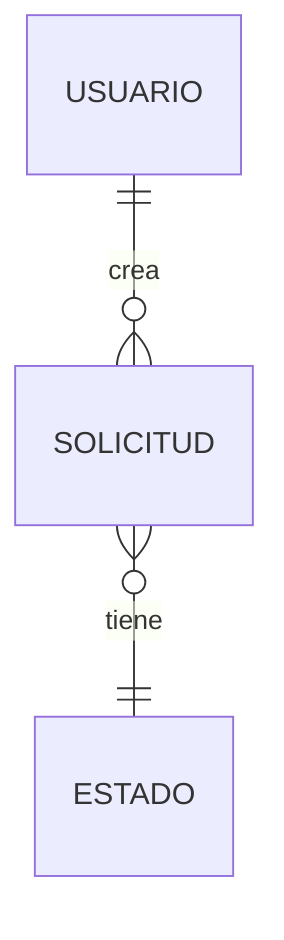

# Functional Specification Document (FSD) – Plantilla

> **Instrucciones para el grupo**: completen todas las secciones. Las partes en `<…>` son marcadores que deben reemplazar. Mantengan trazabilidad explícita a los ítems del PRD usando IDs (`PRD-XX` → `FSD-XX`). Este documento se versiona en Git en `docs/fsd/` y se revisa con Claude como *reviewer*.

## Modos soportados por esta plantilla

Esta plantilla soporta **dos modos** según S04 §B0 Ficha 4 (FSD clásico) y Ficha 5 (LFSD — Lightweight FSD):

| Modo | Cuándo elegirlo | Marca |
|------|------------------|-------|
| **FSD clásico** | Cobertura completa del documento, recomendado para la **entrega final** del módulo cuando el dominio está estabilizado. | 🔧 |
| **LFSD — Lightweight FSD** | Versión ágil mantenida **viva** durante la iteración Sprint‑a‑Sprint; integra UI/UX del M2; convive con Spec Kit fase Tasks. Recomendado durante **Avance Intermedio** y exploraciones tempranas. | ⚡ |

**Cómo leer las marcas en cada sección**:

- ⚡🔧 → obligatoria en **ambos** modos.
- 🔧 → obligatoria en FSD clásico; **opcional o reducida** en LFSD.
- ⚡ → obligatoria en LFSD (mantenimiento vivo); en FSD clásico también está, generalmente con mayor profundidad.
- *(opcional)* → opcional en ambos modos; aplica solo si el grupo lo declara.

> **El grupo declara el modo en §0 Metadatos** y respeta el checklist correspondiente al final del documento.

---

## 0. Metadatos ⚡🔧

| Campo | Valor |
|-------|-------|
| Producto | `<Nombre del producto>` |
| Grupo | `<G1 / G2 / G3 / G4>` |
| Versión del documento | `v0.1` |
| Fecha | `<dd/mm/aaaa>` |
| Autores | `<nombres>` |
| Revisores | Docente + 1 grupo par |
| Estado | Borrador / En revisión / Aprobado |
| **Modo elegido** | **LFSD ⚡** / **FSD clásico 🔧** (marque una) |
| Trazabilidad a PRD | `<PRD v….md>` |
| Insumos M2 (UI/UX) | `<rutas a wireframes / mockups / use cases del módulo anterior>` |
| Fase Spec Kit cubierta | Specify ✅ / Plan ⬜ / Tasks ⬜ / Implement ⬜ |
| Prompts utilizados | `<IDs de docs/PROMPT_MAPPING.md, p. ej. PR-FSD-001>` |

## 1. Resumen ejecutivo ⚡🔧

Entre 150 y 250 palabras. Responde: **¿qué hace el sistema, para quién, y cuál es el valor diferencial?**.

## 2. Alcance ⚡🔧

### 2.1 Dentro del alcance
- `<Funcionalidad 1>`
- `<Funcionalidad 2>`

### 2.2 Fuera del alcance (explícito)
- `<Funcionalidad no incluida 1>`

### 2.3 Supuestos y dependencias
- Supuestos técnicos (stack, plataformas, SLA de terceros).
- Dependencias externas (APIs, pasarelas de pago, proveedores de datos).

### 2.4 Plan técnico (Spec Kit fase Plan) 🔧

> Ver S04 §B7.2 (*Spec‑Driven Development con GitHub Spec Kit*). Esta sección concreta el **cómo técnico** del *qué* declarado en el PRD.
>
> **Modo LFSD ⚡**: puede declararse en formato corto (3–5 líneas por bloque). En FSD clásico 🔧, esta sección es obligatoria con detalle.

| Bloque | Contenido |
|--------|-----------|
| **Stack tecnológico** | `<lenguajes, frameworks, runtimes, versiones>` |
| **Arquitectura prevista** | `<estilo: hexagonal, layered, microservicios; ver Sesiones 7–10>` |
| **Project structure** | `<árbol de directorios planeado: backend/, frontend/, infra/, docs/>` |
| **Decisiones técnicas anticipadas** | `<lista corta; las definitivas viven como ADR en docs/adr/>` |
| **Restricciones técnicas** | `<lo que NO se puede hacer: legacy obligado, base de datos preexistente, etc.>` |

### 2.5 Descomposición en Tasks (Spec Kit) ⚡🔧

> Output de la fase **Tasks** de Spec Kit. Cada *task* es un trabajo ejecutable cuyo prompt asociado puede ser disparado por un agente AI o por un humano.

| Task ID | Descripción | Caso de uso (FSD-UC) | Dependencias | Prompt asociado | Estado |
|---------|-------------|----------------------|--------------|-----------------|--------|
| `T-001` | `<Implementar endpoint POST /trámite>` | `FSD-UC-001` | `T-000` (modelo de datos) | `PR-FSD-001` | pendiente |
| `T-002` | `<…>` | | | | |

> **Regla**: cada *task* debe poder cerrarse como un PR autocontenido. Si un *task* requiere más de un PR, descompóngalo.

## 3. Actores y roles del sistema ⚡🔧

| Actor | Tipo (humano/sistema/agente IA) | Responsabilidad principal | Permisos clave |
|-------|---------------------------------|---------------------------|----------------|
| `<Administrador>` | humano | … | … |
| `<Agente clasificador>` | agente IA | … | … |

## 4. Casos de uso funcionales ⚡🔧

> Completar **al menos 3 casos de uso críticos** con la estructura siguiente. Cada caso debe estar numerado (`FSD-UC-001`, …) y ligado a un prompt‑contrato en la sección 7.
>
> **Modo LFSD ⚡**: ≥ 3 casos críticos con flujo principal y criterios Gherkin mínimos. **FSD clásico 🔧**: ≥ 3 casos críticos con flujo principal, alternativos, excepciones y datos detallados.

### 4.1 FSD-UC-001 – `<Nombre del caso de uso>`

- **Trazabilidad**: `PRD-REQ-…`
- **Actor principal**: `<…>`
- **Precondiciones**:
  1. `<…>`
- **Disparador**: `<…>`
- **Flujo principal**:
  1. `<Paso 1>`
  2. `<Paso 2>`
  3. `<…>`
- **Flujos alternativos / excepciones**:
  - `<A1>`: `<descripción>` → resultado esperado.
- **Postcondiciones**:
  1. `<…>`
- **Reglas de negocio aplicables** (referencia a sección 5): `BR-…`
- **Datos de entrada** (ver sección 6):
- **Datos de salida**:
- **Criterios de aceptación** (formato Gherkin sugerido):

```gherkin
Dado   <contexto>
Cuando <acción>
Entonces <resultado verificable>
```

### 4.2 FSD-UC-002 – `<…>`

*(replicar estructura)*

### 4.3 FSD-UC-003 – `<…>`

*(replicar estructura)*

## 5. Reglas de negocio ⚡🔧

| ID | Regla | Tipo | Origen | Casos de uso afectados |
|----|-------|------|--------|------------------------|
| BR-001 | `<Descripción formal>` | validación / cálculo / política | PRD-… / normativa externa | FSD-UC-001, … |

## 6. Modelo de datos funcional ⚡🔧

### 6.1 Diagrama ER (Mermaid)



### 6.2 Diccionario de datos

| Entidad | Atributo | Tipo | Obligatorio | Validaciones | Origen |
|---------|----------|------|-------------|--------------|--------|
| `<Usuario>` | `id` | UUID | sí | formato UUIDv4 | sistema |
| `<Usuario>` | `email` | string(120) | sí | regex RFC 5322 | usuario |

## 7. Prompt como Contrato Funcional ⚡🔧

> Cada caso de uso crítico debe tener un **prompt‑contrato** asociado con los 6 elementos de la anatomía del prompt.

### 7.1 Prompt‑contrato para FSD-UC-001

```markdown
# Role
Eres <rol del sistema/agente>.

# Task
<Qué debe producir este caso de uso en términos operativos>

# Context
- Entrada: <estructura y tipos>
- Referencias de dominio: <reglas BR-… aplicables>
- Restricciones: <reglas de negocio, límites, compliance>

# Reasoning
Pasos obligatorios:
1. <Validar entrada X>
2. <Consultar Y>
3. <Decidir Z>

# Stop condition
Detente cuando: <condición verificable> o cuando se cumpla <caso de error>.

# Output
Formato: <JSON Schema / texto estructurado / evento>
Ejemplo de salida:
```

```json
{
  "status": "ok",
  "data": { "...": "..." }
}
```

**Invariants**: `<lista de invariantes que el output debe cumplir>`
**Failure modes**: `<códigos y mensajes>`

### 7.2 Prompt‑contrato para FSD-UC-002

*(replicar)*

### 7.3 Métricas de prompt‑contract *(opcional)*

> Ver S04 §B5 (*AI‑Native Operating Model + AI‑SDLC*). **Opcional**: úselo si el grupo declara aplicar AI‑SDLC con instrumentación.

| Métrica | Definición operativa | Umbral sugerido | Cómo se mide |
|---------|----------------------|------------------|---------------|
| **Prompt coverage** | % de casos de uso críticos con prompt‑contrato vivo y testeado | ≥ 80 % | revisión por pares + grep en `docs/PROMPT_MAPPING.md` |
| **Spec fidelity** | % de outputs del agente que respetan los *Invariants* y *Failure modes* declarados en §7 | ≥ 90 % | suite de tests contra prompt‑contrato + revisión humana |
| **Hallucination rate** | % de afirmaciones del agente sin trazabilidad a una fuente del FSD/PRD/MRD/BRD | ≤ 5 % | auditoría de outputs de muestra (≥ 30 ejecuciones) |
| **Reversion rate** | % de PRs derivados de prompts que se revirtieron antes de release | ≤ 10 % | git log + etiqueta `revert-prompt` |

> **Regla mínima**: si el grupo declara AI‑SDLC, debe reportar **al menos** *prompt coverage* y *spec fidelity*. Las otras dos son recomendadas.

## 8. Integraciones externas 🔧

| Sistema | Tipo | Protocolo | Operaciones | SLA esperado | Autenticación |
|---------|------|-----------|-------------|--------------|---------------|
| `<Pasarela de pago>` | síncrono REST | HTTPS | `POST /charge` | 99.9 % / 1.5 s p95 | OAuth2 |

## 9. Interfaces de usuario (referencia) ⚡🔧

- Enlace a Figma / mockups del Módulo 2 (UX/UI).
- Mapeo **pantalla → caso de uso**: tabla.

| Pantalla | Caso de uso cubierto |
|----------|----------------------|
| `/login` | FSD-UC-… |

### 9.1 Trazabilidad con M2 (UI/UX) ⚡🔧

> Ver S04 §B8. Los wireframes / mockups / *skyboards* del módulo M2 **son insumo legítimo** del FSD/LFSD: aterrizan como pantallas con caso de uso asociado.

| Wireframe / mockup M2 | Pantalla FSD | Caso de uso (FSD-UC) | Estado de la traza |
|-----------------------|--------------|----------------------|---------------------|
| `<wireframe_iniciar_tramite_v2.png>` | `/tramites/nuevo` | `FSD-UC-001` | ✅ cubierto |
| `<…>` | | | |

> **Regla LFSD ⚡**: si el modo es Lightweight, esta tabla es **obligatoria** porque el LFSD vive integrado con UI/UX. En FSD clásico 🔧 también es obligatoria, pero puede vivir como anexo.

## 10. Requerimientos No Funcionales (NFR) ⚡🔧

| ID | Categoría | Requisito | Métrica | Umbral | Cómo se verifica |
|----|-----------|-----------|---------|--------|------------------|
| NFR-001 | Rendimiento | Latencia de `POST /order` | p95 | < 100 ms | prueba de carga k6 |
| NFR-002 | Disponibilidad | `<servicio crítico>` | uptime mensual | ≥ 99.9 % | monitoreo |
| NFR-003 | Seguridad | Cifrado en reposo | AES‑256 | obligatorio | auditoría |
| NFR-004 | Observabilidad | Trazabilidad *end‑to‑end* | % requests con `traceId` | 100 % | OpenTelemetry |
| NFR-005 | Escalabilidad | Throughput máximo | req/s sostenido | ≥ `<N>` | prueba de stress |
| NFR-006 | Cumplimiento | Ley 164 / GDPR / PCI‑DSS | aplicable | según ley | revisión legal |

## 11. Trazabilidad MRD → PRD → FSD ⚡🔧

| MRD (necesidad) | PRD (requerimiento) | FSD (caso de uso) | NFR | Prueba de aceptación |
|-----------------|---------------------|-------------------|-----|----------------------|
| `MRD-N-01` | `PRD-REQ-01` | `FSD-UC-001` | `NFR-001` | `TC-01` |

## 12. Plan de pruebas funcionales 🔧

- Estrategia (unitarias, integración, E2E, contract testing con prompt‑contratos).
- Herramientas: `<JUnit / pytest / Playwright / k6>`.
- Cobertura mínima aceptada: **`<80 %>`** en dominio *core*.

> **Modo LFSD ⚡**: declare al menos *estrategia mínima* (qué se prueba y cómo) y *herramientas elegidas*. La cobertura objetivo y las herramientas detalladas pueden quedarse para el FSD clásico al cierre.

### 12.1 Exploración con Vibe Coding *(opcional)*

> Ver S04 §B0 Ficha 6 y §B7.2. **Opcional**. Si durante la elaboración del FSD/LFSD el grupo usó Vibe Coding para explorar viabilidad técnica o validar interacciones, regístrelo aquí.

| Exploración | Pregunta técnica que valida | Prompts utilizados | Conclusión que entra al FSD |
|-------------|-----------------------------|---------------------|------------------------------|
| `<spike: ¿GraphQL o REST para /tramites?>` | latencia + complejidad de cliente | `PR-VIBE-002` | REST elegido; ADR pendiente; afecta `FSD-UC-001` §7.1 |
| `<…>` | | | |

> **Importante**: Vibe Coding es legítimo **antes** de estabilizar el FSD; **no** es legítimo como reemplazo del prompt‑contrato del §7. Cualquier código generado debe cubrirse por un prompt‑contrato y por las métricas de §7.3 antes de entrar a `main`.

## 13. Riesgos funcionales ⚡🔧

| Riesgo | Probabilidad | Impacto | Mitigación | Responsable |
|--------|--------------|---------|------------|-------------|
| `<…>` | alta / media / baja | alto / medio / bajo | `<…>` | `<…>` |

## 14. Glosario 🔧

| Término | Definición |
|---------|------------|
| `<Término>` | `<…>` |

## 15. Registro de cambios ⚡🔧

| Versión | Fecha | Autor | Cambio |
|---------|-------|-------|--------|
| v0.1 | `<dd/mm/aaaa>` | `<…>` | Versión inicial |

---

## Checklist de entrega — modo LFSD ⚡

> Aplica si el grupo declaró **modo LFSD** en §0 Metadatos. Avance Intermedio del módulo o iteraciones tempranas.

- [ ] §0 Metadatos completos, modo declarado como **LFSD ⚡**.
- [ ] §1 Resumen ejecutivo (150–250 palabras).
- [ ] §2 Alcance + §2.5 Tasks (≥ 5 tasks ejecutables con prompt asociado).
- [ ] §3 Actores (resumen).
- [ ] **≥ 3 casos de uso críticos** (§4) con flujo principal y Gherkin mínimo.
- [ ] §5 Reglas de negocio.
- [ ] §6 Modelo de datos básico (diagrama Mermaid + entidades core).
- [ ] **Un prompt‑contrato por caso de uso crítico** (§7).
- [ ] §9 + **§9.1 Trazabilidad con M2 obligatoria** (Wireframe → Pantalla → UC).
- [ ] §10 NFRs: al menos 3 críticos con métrica y umbral.
- [ ] §11 Trazabilidad MRD → PRD → FSD.
- [ ] §12 Plan de pruebas (estrategia mínima).
- [ ] §13 Riesgos funcionales.
- [ ] §15 Registro de cambios.
- [ ] Revisión por pares registrada como comentarios en el PR.

> Secciones **opcionales en LFSD**: §2.4 Plan técnico (puede ser corto), §7.3 Métricas prompt‑contract, §8 Integraciones detalladas, §12.1 Vibe Coding, §14 Glosario.

## Checklist de entrega — modo FSD clásico 🔧

> Aplica si el grupo declaró **modo FSD clásico** en §0 Metadatos. Entrega final / cierre del módulo (Avance Intermedio – 40 %).

- [ ] §0 Metadatos completos, modo declarado como **FSD clásico 🔧**, versión inicial commiteada en Git.
- [ ] §1 Resumen ejecutivo (150–250 palabras).
- [ ] §2 Alcance y fuera de alcance explícitos + **§2.4 Plan técnico detallado** + §2.5 Tasks.
- [ ] §3 Actores y permisos.
- [ ] **≥ 3 casos de uso críticos** con flujos principal, alternativos y excepciones, datos de entrada/salida y criterios Gherkin.
- [ ] §5 Reglas de negocio con tipo y origen.
- [ ] §6 Modelo de datos completo (diagrama Mermaid + diccionario completo).
- [ ] **Un prompt‑contrato por caso de uso crítico** con los 6 elementos de la anatomía (§7).
- [ ] §8 Integraciones externas con SLA y autenticación.
- [ ] §9 + **§9.1 Trazabilidad con M2** (Wireframe → Pantalla → UC).
- [ ] §10 NFRs con métrica, umbral y forma de verificación.
- [ ] §11 Matriz de trazabilidad MRD → PRD → FSD → NFR → prueba.
- [ ] §12 Plan de pruebas detallado (estrategia + herramientas + cobertura objetivo).
- [ ] §13 Riesgos funcionales.
- [ ] §14 Glosario.
- [ ] §15 Registro de cambios.
- [ ] Revisión por pares (otro grupo) registrada como comentarios en el PR.

> Secciones **opcionales** en ambos modos: §0.1 Constitution (en PRD), §7.3 Métricas prompt‑contract, §12.1 Vibe Coding.
