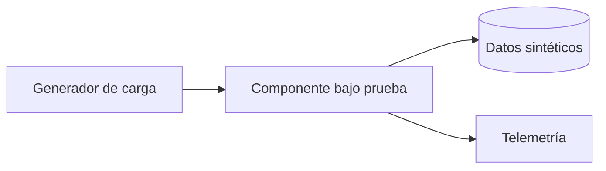

# Prueba de Concepto (POC) – Plantilla

> **Propósito**: validar **tempranamente** una hipótesis arquitectónica antes de comprometer la construcción completa. Una POC NO es un MVP: su objetivo es **eliminar una incertidumbre concreta**.
>
> **Entrega**: cada grupo ejecuta mínimo **2 POCs críticas** durante el módulo. Cada POC vive en `pocs/<id>/` con código, evidencia y resultado.

---

## POC‑NN: `<Nombre corto>`

### 0. Metadatos

| Campo | Valor |
|-------|-------|
| ID | `POC-NN` |
| Título | `<…>` |
| Grupo | `<Gn>` |
| Responsable(s) | `<…>` |
| Fecha de inicio | `<dd/mm/aaaa>` |
| Fecha objetivo de cierre | `<dd/mm/aaaa>` |
| Estado | Propuesta / En ejecución / Completada / Descartada |
| ADR relacionado | `<ADR‑NNNN>` |

### 1. Riesgo que mitiga

Describir la **incertidumbre específica** que se busca resolver. Ejemplos: "¿El *matching engine* sostiene 500 órdenes/s con latencia p95 < 50 ms?", "¿Claude Sonnet clasifica correctamente el 90 % de las solicitudes académicas?".

### 2. Hipótesis

Una afirmación **falsable** y verificable. Formato:

> *Creemos que `<tecnología/patrón>` permitirá `<resultado medible>` bajo `<condición>`.*

### 3. Criterio de éxito medible (SMART)

- Métrica principal: `<p95 de latencia, accuracy, throughput, costo USD/1k req>`.
- Umbral para declarar éxito: `<…>`.
- Umbral para declarar fracaso: `<…>` (obligatorio: tiene que existir).

### 4. Alcance reducido (time‑boxed)

- **Funcionalidades incluidas**: mínimas para probar la hipótesis.
- **Funcionalidades excluidas**: explícitamente.
- **Duración máxima**: `<N días/semanas>`. Si se excede, se cierra y se documenta lo aprendido.

### 5. Diseño de la prueba

#### 5.1 Stack usado

| Componente | Tecnología | Versión |
|------------|------------|---------|
| | | |

#### 5.2 Arquitectura de la POC

#### 5.3 Datos de prueba

- Origen: sintéticos / muestra anonimizada / dataset público.
- Volumen: `<N registros>`.
- Sesgos conocidos: `<…>`.

#### 5.4 Procedimiento experimental

1. Pasos repetibles.
2. Parámetros controlados y variables.
3. Repeticiones mínimas.

### 6. Entorno

- **Local / contenedores / cloud**: `<…>`.
- **Recursos**: CPU, RAM, tipo de instancia AWS, cuota.
- **Costo estimado**: `<USD>`.

### 7. Herramientas de medición

- `<k6, Gatling, Locust>` para carga.
- `<Prometheus + Grafana, CloudWatch>` para métricas.
- `<Datadog, Langfuse>` si aplica a agentes IA.

### 8. Plan de ejecución

| Día | Actividad | Responsable |
|-----|-----------|-------------|
| 1 | setup entorno | |
| 2 | implementación mínima | |
| 3 | ejecución y captura | |
| 4 | análisis y reporte | |

### 9. Resultados

> Completar **al finalizar** la POC.

#### 9.1 Tabla de métricas

| Métrica | Valor obtenido | Umbral éxito | Veredicto |
|---------|----------------|--------------|-----------|
| p95 latencia | | | ✅/❌ |
| Throughput | | | |
| Costo por 1k req | | | |

#### 9.2 Gráficos / capturas

- Enlaces a `pocs/<id>/evidencia/` con gráficos y dumps de telemetría.

### 10. Conclusiones y veredicto

- **Veredicto**: ✅ éxito / ⚠️ parcial / ❌ fracaso.
- **Justificación** basada en métricas.
- **Próximos pasos**:
  - Si éxito → integrar en la arquitectura principal. Crear ADR si no existe.
  - Si parcial → POC‑v2 con ajustes.
  - Si fracaso → abandonar alternativa; documentar aprendizaje.

### 11. Aprendizajes (*lessons learned*)

- Técnico: `<…>`.
- De equipo: `<…>`.
- De herramientas: `<…>`.

### 12. Riesgos remanentes

- Escenarios no cubiertos por la POC que siguen siendo riesgo en producción.

### 13. Referencias

- Papers, blog posts, benchmarks.

### 14. Historial

| Versión | Fecha | Autor | Cambio |
|---------|-------|-------|--------|
| 1 | | | creación |
| 2 | | | resultados agregados |

---

## Checklist de cierre de POC

- [ ] Hipótesis y criterio de éxito declarados **antes** de ejecutar.
- [ ] Alcance time‑boxed respetado.
- [ ] Resultados numéricos con evidencia en `pocs/<id>/evidencia/`.
- [ ] Veredicto explícito (✅ / ⚠️ / ❌).
- [ ] Aprendizajes capturados.
- [ ] ADR creado o actualizado si la POC cambia una decisión arquitectónica.
