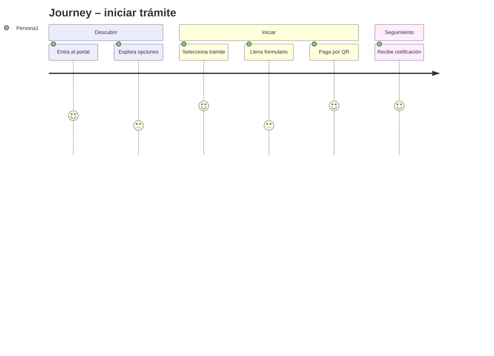

# Product Requirements Document (PRD) – Plantilla

> **Propósito del PRD**: describir **qué debe hacer el producto** para cumplir los requerimientos del MRD y BRD, con nivel suficiente para que diseño, ingeniería y QA puedan proceder. Responde a **"¿qué hace el producto?"** (no *cómo* lo hace).
>
> Audiencia: Product, Diseño (UX/UI), Ingeniería, QA.

---

## 0. Metadatos

| Campo | Valor |
|-------|-------|
| Producto | `<Nombre>` |
| Grupo | `<G1/G2/G3/G4>` |
| Versión | `v0.1` |
| Fecha | `<dd/mm/aaaa>` |
| Product Manager / Autor | `<…>` |
| Revisores | Docente + Tech Lead + QA |
| Estado | Borrador / En revisión / Aprobado |
| BRD de referencia | `<BRD v…>` |
| MRD de referencia | `<MRD v…>` |
| Insumos M2 (UI/UX) | `<rutas a wireframes, mockups, use cases, journeys del módulo anterior>` |
| Fase Spec Kit cubierta | Specify ✅ / Plan ⬜ / Tasks ⬜ / Implement ⬜ |
| Prompts utilizados | `<IDs de docs/PROMPT_MAPPING.md, p. ej. PR-PRD-001>` |

## 0.1 Constitution (opcional — Spec Kit)

> **Opcional**. Si el grupo aplica **Spec‑Driven Development con GitHub Spec Kit** (ver S04 §B7.2), declare aquí la *constitution* del proyecto: principios **no negociables** que cualquier decisión posterior debe respetar. Si no se aplica, deje vacío.

- **Principio 1**: `<p. ej. "todo flujo crítico debe completarse en ≤ 3 pasos">`.
- **Principio 2**: `<p. ej. "ningún dato sensible se loggea ni en producción ni en debug">`.
- **Principio 3**: `<p. ej. "toda funcionalidad debe poder usarse sin internet por ≥ 60 segundos">`.

> Estos principios funcionan como *invariantes a nivel de producto*: aparecerán como guardrails en los prompts del FSD y como criterios de auditoría en revisiones.

## 1. Resumen del producto

De 100 a 200 palabras. Problema, usuarios, solución y valor.

## 2. Objetivos del producto

Cada objetivo enlaza a un objetivo de negocio (BRD).

| ID | Objetivo del producto | BRD vinculado | Métrica | Meta |
|----|------------------------|----------------|---------|------|
| OP-01 | `<Permitir iniciar un trámite en ≤ 3 minutos>` | BO-01 | tiempo mediano | ≤ 3 min |
| OP-02 | `<…>` | | | |

## 3. Alcance (*Scope*)

### 3.1 Dentro del alcance (release v1.0)

- `<Funcionalidad 1>`.
- `<Funcionalidad 2>`.

### 3.2 Fuera del alcance (backlog)

- `<Funcionalidad pospuesta>` – justificación.

### 3.3 Roadmap de versiones (Delivery track)

| Versión | Contenido | Fecha objetivo |
|---------|-----------|----------------|
| v1.0 | MVP | `<…>` |
| v1.1 | | |
| v2.0 | | |

### 3.4 Roadmap de validación (Discovery track)

> Ver S04 §B6 (*Continuous Discovery + Dual‑Track Agile*). En paralelo al *Delivery track* corre el *Discovery track*: hipótesis a validar **antes** de construir.

| Sprint / Semana | Hipótesis a validar | Método | Criterio de éxito | Estado |
|-----------------|---------------------|--------|-------------------|--------|
| `<S1>` | `<estudiante prefiere QR sobre transferencia>` | encuesta + 5 entrevistas | ≥ 70 % preferencia | abierta |
| `<S2>` | `<…>` | | | |

> **Regla de oro**: ninguna *user story* `Must` entra al Delivery track sin una hipótesis validada en el Discovery track.

## 4. Personas y *user journeys*

### 4.1 Personas (resumen, extendidas en MRD)

- `<Persona 1>`: rol + necesidad principal.
- `<Persona 2>`: rol + necesidad principal.

### 4.2 *User journeys* principales (mínimo 2)



## 5. *User stories* y criterios de aceptación

> Mínimo **15 historias** priorizadas. Formato: "Como `<rol>`, quiero `<acción>` para `<beneficio>`". Cada historia cumple INVEST.

### 5.1 Épica E1 – `<Nombre de la épica>`

| ID | Historia | Prioridad | Valor | Esfuerzo | Criterios Gherkin |
|----|----------|-----------|-------|----------|-------------------|
| PRD-US-001 | Como estudiante, quiero iniciar un trámite en línea para no desplazarme | Must | 8 | 5 | ver §5.1.1 |
| PRD-US-002 | `<…>` | | | | |

#### 5.1.1 Criterios PRD-US-001

```gherkin
Escenario: Estudiante con saldo al día inicia trámite
  Dado un estudiante autenticado con saldo al día
  Cuando selecciona "Iniciar trámite de certificado"
  Entonces el sistema crea una solicitud en estado PENDIENTE_PAGO
   Y retorna el identificador de la solicitud en < 2 segundos
```

### 5.2 Épica E2 – `<…>`

*(replicar)*

## 6. Priorización

| Método | Ranking |
|--------|---------|
| MoSCoW | Must > Should > Could > Won't |
| RICE | `Reach × Impact × Confidence ÷ Effort` |

Tabla RICE (para las 10 historias *top*):

| ID | Reach | Impact (0.25–3) | Confidence (%) | Effort | RICE |
|----|-------|-----------------|----------------|--------|------|
| PRD-US-001 | 10000 | 2 | 80 | 5 | 3200 |

## 7. Requerimientos funcionales (alto nivel)

| ID | Requisito | Historia(s) | Prioridad |
|----|-----------|-------------|-----------|
| PRD-REQ-001 | El sistema debe permitir autenticación vía usuario institucional | PRD-US-001 | Must |
| PRD-REQ-002 | El sistema debe aceptar pagos QR SIMPLE / Tigo Money | PRD-US-005 | Must |

## 8. Requerimientos no funcionales (alto nivel)

| ID | Categoría | Requerimiento | Métrica | Umbral |
|----|-----------|---------------|---------|--------|
| PRD-NFR-001 | Rendimiento | tiempo de respuesta API | p95 | < 500 ms |
| PRD-NFR-002 | Seguridad | protección PII | cifrado | AES‑256 |

> Estos NFRs se detallan con mecanismo de verificación en el FSD §10.

## 9. Dependencias e integraciones

| Sistema | Tipo | Propósito | Riesgo |
|---------|------|-----------|--------|
| `<SIS Académico>` | consumo | datos de estudiantes | alta |
| `<Gateway de pagos>` | consumo | cobros QR | alta |

## 10. Supuestos y restricciones

- **Supuestos**: `<…>`.
- **Restricciones**: presupuesto, plazo, stack obligatorio, cumplimiento.

## 11. Experiencia de usuario

- Referencia a Figma / mockups (Módulo 2 UX/UI).
- Lineamientos de diseño (design system, accesibilidad WCAG 2.2 AA).

### 11.1 Trazabilidad con M2 (UI/UX)

> Ver S04 §B8 (*Continuidad con el Módulo Anterior + Agente Explorador*). El trabajo del módulo M2 **no se pierde y no está fuera de orden**: aterriza aquí como evidencia validada.

#### Use Cases del M2 ↔ User Stories del PRD

| Use Case M2 | User Story PRD | Estado de la traza |
|-------------|----------------|---------------------|
| `<UC-M2-01: Estudiante consulta calendario>` | `PRD-US-003` | ✅ cubierto / ⚠️ parcial / ❌ pendiente |
| `<UC-M2-02: …>` | `PRD-US-…` | |

#### Wireframes / Mockups M2 ↔ Pantallas del PRD

| Wireframe M2 | Pantalla / flujo PRD | Estado |
|--------------|----------------------|--------|
| `<wireframe_login_v2.png>` | flujo §4.2 *Iniciar sesión* | validado |
| `<…>` | | |

> **Regla**: si un wireframe M2 no aparece en este PRD, declárelo como *fuera de alcance* en §3.2 con justificación. No silencie trabajo previo.

### 11.2 Exploración con Vibe Coding (opcional)

> **Opcional**. Si el grupo usó **Vibe Coding** durante Discovery o validación de UI/UX (ver S04 §B0 Ficha 6), regístrelo aquí. Esto es legítimo cuando alimenta al PRD; **no** lo es cuando reemplaza la especificación.

| Exploración | Pregunta de Discovery que valida | Prompts utilizados (PROMPT_MAPPING) | Conclusión que entra al PRD |
|-------------|----------------------------------|--------------------------------------|------------------------------|
| `<prototipo de flujo de pago QR>` | "¿el usuario completa el pago en ≤ 30s?" | `PR-VIBE-001` | confirma `PRD-US-005`, sugiere ajuste en §4.2 |
| `<…>` | | | |

> **Trazabilidad obligatoria**: cada fila debe enlazar a un *prompt registrado* en `docs/PROMPT_MAPPING.md` y a una *user story* o *NFR* del PRD que se modificó como consecuencia.

## 12. Métricas de éxito del producto

- **North Star**: `<…>`.
- **KPIs de adopción**: `<…>`.
- **KPIs de calidad**: tasa de errores, MTTR.

## 13. Riesgos del producto

| Riesgo | Prob. | Impacto | Mitigación |
|--------|-------|---------|------------|
| `<Baja adopción de pago QR>` | media | alto | plan B con transferencia bancaria |

## 14. Trazabilidad

| PRD ID | BRD | MRD | FSD (próximo) |
|--------|-----|-----|----------------|
| PRD-REQ-001 | BR-001 | MRD-N-01 | FSD-UC-001 |

## 15. Anexos

- Transcripción de entrevistas.
- Análisis competitivo detallado.
- *Wireframes* anexos.

## 16. Registro de cambios

| Versión | Fecha | Autor | Cambio |
|---------|-------|-------|--------|
| v0.1 | | | versión inicial |

---

## Checklist mínimo

- [ ] ≥ 15 *user stories* con INVEST y Gherkin.
- [ ] Priorización MoSCoW + RICE para top‑10.
- [ ] ≥ 2 *user journeys* en Mermaid.
- [ ] NFRs alto nivel con umbrales.
- [ ] Roadmap de versiones.
- [ ] Trazabilidad BRD → MRD → PRD → FSD iniciada.
- [ ] Revisión documentada por pares.
